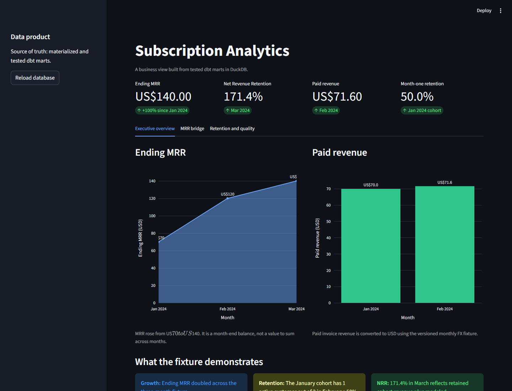

# Subscription Analytics with dbt and DuckDB

A local dbt project for subscription analytics. It loads versioned synthetic data into DuckDB and produces tested models for MRR, revenue, churn, retention, customer activity, and product events.

## What it calculates

- Monthly recurring revenue and monthly revenue.
- MRR movements: new, expansion, contraction, churn, and reactivation.
- Net Revenue Retention with a fixed initial-cohort denominator.
- Subscription cohorts, retention rates, and churn by plan and signup month.
- Customer subscription history and SCD Type 2 changes.
- Product events with incremental processing and late-event handling.

## Architecture

```text
Versioned synthetic seeds
  -> typed staging models
  -> subscription periods, MRR movements, customer activity
  -> finance, customer, retention, and product marts
  -> dashboard exposures and dbt documentation
```

## Project structure

```text
streaming_project/
├── seeds/                     # Versioned subscription source fixtures
├── models/
│   ├── staging/                # Typed billing, CRM, and product sources
│   ├── intermediate/           # Subscription periods, MRR movements, activity
│   └── marts/
│       ├── finance/            # MRR, revenue, and NRR marts
│       ├── customer/           # Customers, subscriptions, and cohorts
│       └── product/            # Incremental product events
├── snapshots/                  # Customer SCD Type 2 history
├── tests/                      # Semantic regression tests
└── macros/                     # Safe division and FX conversion helpers
```

## Setup

```bash
git clone https://github.com/J0BS013/subscription-analytics-dbt.git
cd subscription-analytics-dbt
python -m pip install -r requirements.txt
```

## How to run

Run the complete local build:

```bash
python -m dbt.cli.main build --project-dir streaming_project --profiles-dir .
```

The build loads the CSV seeds, creates models, runs tests, and executes the customer snapshot. The local database is written to `streaming_project/streaming_data.duckdb`.

Run only the snapshot after a customer-attribute correction:

```bash
python -m dbt.cli.main snapshot --project-dir streaming_project --profiles-dir .
```

Generate and serve local lineage documentation:

```bash
python -m dbt.cli.main docs generate --project-dir streaming_project --profiles-dir .
python -m dbt.cli.main docs serve --project-dir streaming_project --profiles-dir .
```

## Interactive dashboard

Build the dbt project first, then launch the local dashboard:

```bash
python -m dbt.cli.main build --project-dir streaming_project --profiles-dir .
streamlit run app.py
```

The dashboard reads only the materialized dbt marts in DuckDB and is organized into three views:

- **Executive overview:** ending MRR, paid revenue, NRR, retention, and the main business findings.
- **MRR bridge:** new, expansion, reactivation, contraction, and churn movements reconciled with ending MRR.
- **Retention and quality:** cohort-retention heatmap, NRR trend, test coverage, late-event policy, and SCD Type 2 history.

The synthetic fixture demonstrates MRR growth from US$70 to US$140, 50% month-one retention for the January cohort using a fixed denominator, and March NRR of 171.4%. NRR is presented separately from customer retention because expansion and reactivation can increase retained revenue without increasing retained logos.

It is a local synthetic-data demo, not a production reporting system.



### Deployment

The application is compatible with Streamlit Community Cloud and similar Python hosting services. It uses `app.py` as the entry point and installs dependencies from `requirements.txt`. In a clean environment, the app runs the pinned dbt Core build once to materialize the tested DuckDB marts before loading the dashboard; no credentials or external database are required.

## Key models

| Model | Grain | Purpose |
|---|---|---|
| `int_subscription_periods` | subscription × month | Active periods and monthly recurring revenue |
| `int_mrr_movements` | subscription movement × month | New, expansion, contraction, churn, and reactivation |
| `fct_mrr_movements` | MRR movement | Enforced contract for the finance interface |
| `mart_mrr_monthly` | month | MRR bridge and ending MRR |
| `mart_nrr_monthly` | month | Fixed-cohort Net Revenue Retention |
| `mart_retention_cohorts` | signup cohort × activity month | Retention analysis |
| `fct_product_events` | product event | Incremental, deduplicated event fact |
| `customers_snapshot` | customer version | SCD Type 2 customer history |

## Data quality and semantic checks

The project includes 43 data tests and semantic checks for:

- a January 2024 cohort of two subscribers retaining one active subscriber in February, producing 50% retention;
- fixed cohort-size and NRR denominators;
- MRR bridge reconciliation;
- unique keys, required fields, relationships, and allowed movement types;
- product-event deduplication and model contracts.

The complete local build validates 76 dbt nodes: 10 seeds and 66 build nodes. GitHub Actions runs the seed and build path on pushes and pull requests.

## Versioned metrics and CI

The [metric contract](streaming_project/semantic_models/subscription_metrics.yml) defines the model, grain, aggregation rule, and denominator for MRR, MRR change, paid revenue, NRR, and cohort retention. It prevents dashboards from independently redefining business metrics; in particular, ending MRR is a month-end balance and must not be summed across months.

On pull requests, GitHub Actions creates a parse manifest for the base branch and publishes the state-aware impacted dbt graph. The project also performs a clean full build because the local DuckDB CI environment has no persistent warehouse relations to defer to. See [warehouse portability](docs/warehouse-portability.md) for how this maps to managed warehouses.

## Late data and recovery

`fct_product_events` reprocesses a seven-day lookback window so late-arriving product events can update recent output. If a source schema or model contract changes, dbt fails before downstream marts are built. Generated DuckDB databases, logs, and target artifacts are ignored by Git.

## Assumptions and limitations

- The source data is synthetic and intended for local analytics workflows.
- Currency conversion, revenue, and retention definitions are implemented for the supplied fixture.
- See [the benchmark](docs/benchmark.md) for measured local execution results and limitations.
- See [warehouse portability](docs/warehouse-portability.md) for adapter, physical-design, and CI trade-offs.
